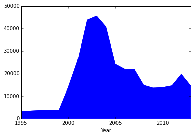
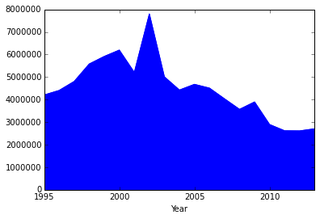
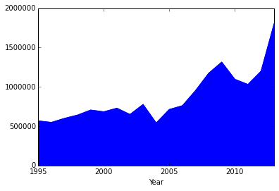
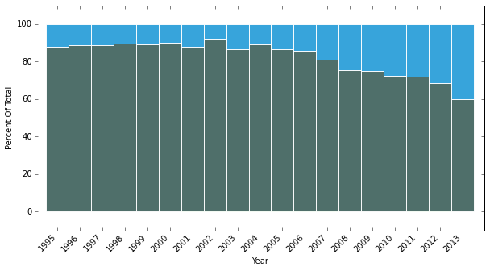
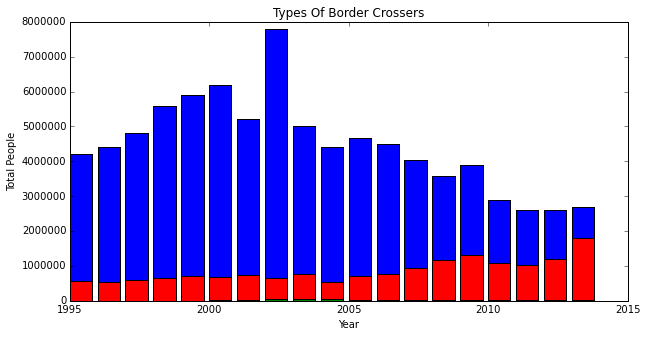
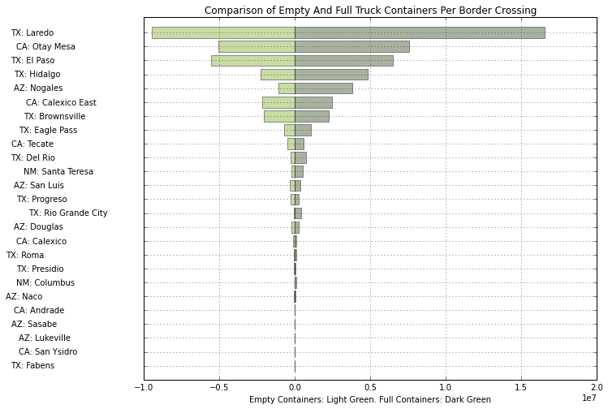

# Wrangling DHS Border Crossing Data

- **Author:** [Chris Albon](http://www.chrisalbon.com/),
[@ChrisAlbon](https://twitter.com/chrisalbon)
- **Date:** -
- **Repo:** [Python 3 code snippets for data
science](https://github.com/chrisalbon/code_py)
- **Note:**

    import pandas as pd
    import os
    %matplotlib inline
    import matplotlib.pyplot as plt
    import numpy as np

    cur_dir = os.path.dirname(os.path.realpath('__file__'))

    df = pd.read_csv(cur_dir + '/data/cross_raw_data/' + 'bc_full_crossing_data.csv')

    df.head()

<table border="1" class="dataframe">
  <thead>
    <tr style="text-align: right;">
      <th></th>
      <th>Port Name</th>
      <th>Year</th>
      <th>Month</th>
      <th>Trucks</th>
      <th>Loaded Truck Containers</th>
      <th>Empty Truck Containers</th>
      <th>Trains</th>
      <th>Loaded Rail Containers</th>
      <th>Empty Rail Containers</th>
      <th>Train Passengers</th>
      <th>Buses</th>
      <th>Bus Passengers</th>
      <th>Personal Vehicles</th>
      <th>Personal Vehicle Passengers</th>
      <th>Pedestrians</th>
      <th>City</th>
      <th>State</th>
    </tr>
  </thead>
  <tbody>
    <tr>
      <th>0</th>
      <td> AZ: Douglas                                   ...</td>
      <td> 1995</td>
      <td>  01 - JAN</td>
      <td> 2890</td>
      <td> 0</td>
      <td> 0</td>
      <td> 0</td>
      <td> 0</td>
      <td> 0</td>
      <td> 0</td>
      <td> 270</td>
      <td> 270</td>
      <td> 164803</td>
      <td> 379047</td>
      <td> 40735</td>
      <td> Douglas                                       ...</td>
      <td> AZ</td>
    </tr>
    <tr>
      <th>1</th>
      <td> AZ: Douglas                                   ...</td>
      <td> 1995</td>
      <td>  02 - FEB</td>
      <td> 2849</td>
      <td> 0</td>
      <td> 0</td>
      <td> 0</td>
      <td> 0</td>
      <td> 0</td>
      <td> 0</td>
      <td> 270</td>
      <td> 270</td>
      <td> 146925</td>
      <td> 337926</td>
      <td> 40463</td>
      <td> Douglas                                       ...</td>
      <td> AZ</td>
    </tr>
    <tr>
      <th>2</th>
      <td> AZ: Douglas                                   ...</td>
      <td> 1995</td>
      <td>  03 - MAR</td>
      <td> 3421</td>
      <td> 0</td>
      <td> 0</td>
      <td> 0</td>
      <td> 0</td>
      <td> 0</td>
      <td> 0</td>
      <td> 270</td>
      <td> 270</td>
      <td> 139060</td>
      <td> 319838</td>
      <td> 55370</td>
      <td> Douglas                                       ...</td>
      <td> AZ</td>
    </tr>
    <tr>
      <th>3</th>
      <td> AZ: Douglas                                   ...</td>
      <td> 1995</td>
      <td>  04 - APR</td>
      <td> 3676</td>
      <td> 0</td>
      <td> 0</td>
      <td> 0</td>
      <td> 0</td>
      <td> 0</td>
      <td> 0</td>
      <td> 270</td>
      <td> 270</td>
      <td> 144163</td>
      <td> 331575</td>
      <td> 46279</td>
      <td> Douglas                                       ...</td>
      <td> AZ</td>
    </tr>
    <tr>
      <th>4</th>
      <td> AZ: Douglas                                   ...</td>
      <td> 1995</td>
      <td>  05 - MAY</td>
      <td> 3560</td>
      <td> 0</td>
      <td> 0</td>
      <td> 0</td>
      <td> 0</td>
      <td> 0</td>
      <td> 0</td>
      <td> 270</td>
      <td> 270</td>
      <td> 154597</td>
      <td> 355573</td>
      <td> 50160</td>
      <td> Douglas                                       ...</td>
      <td> AZ</td>
    </tr>
  </tbody>
</table>

    df['Port Name'][1]

    'AZ: Douglas                                                 '

    df_douglas = df[df['Port Name'] == 'AZ: Douglas                                                 '][:]

    df_douglas.head()

<table border="1" class="dataframe">
  <thead>
    <tr style="text-align: right;">
      <th></th>
      <th>Port Name</th>
      <th>Year</th>
      <th>Month</th>
      <th>Trucks</th>
      <th>Loaded Truck Containers</th>
      <th>Empty Truck Containers</th>
      <th>Trains</th>
      <th>Loaded Rail Containers</th>
      <th>Empty Rail Containers</th>
      <th>Train Passengers</th>
      <th>Buses</th>
      <th>Bus Passengers</th>
      <th>Personal Vehicles</th>
      <th>Personal Vehicle Passengers</th>
      <th>Pedestrians</th>
      <th>City</th>
      <th>State</th>
    </tr>
  </thead>
  <tbody>
    <tr>
      <th>0</th>
      <td> AZ: Douglas                                   ...</td>
      <td> 1995</td>
      <td>  01 - JAN</td>
      <td> 2890</td>
      <td> 0</td>
      <td> 0</td>
      <td> 0</td>
      <td> 0</td>
      <td> 0</td>
      <td> 0</td>
      <td> 270</td>
      <td> 270</td>
      <td> 164803</td>
      <td> 379047</td>
      <td> 40735</td>
      <td> Douglas                                       ...</td>
      <td> AZ</td>
    </tr>
    <tr>
      <th>1</th>
      <td> AZ: Douglas                                   ...</td>
      <td> 1995</td>
      <td>  02 - FEB</td>
      <td> 2849</td>
      <td> 0</td>
      <td> 0</td>
      <td> 0</td>
      <td> 0</td>
      <td> 0</td>
      <td> 0</td>
      <td> 270</td>
      <td> 270</td>
      <td> 146925</td>
      <td> 337926</td>
      <td> 40463</td>
      <td> Douglas                                       ...</td>
      <td> AZ</td>
    </tr>
    <tr>
      <th>2</th>
      <td> AZ: Douglas                                   ...</td>
      <td> 1995</td>
      <td>  03 - MAR</td>
      <td> 3421</td>
      <td> 0</td>
      <td> 0</td>
      <td> 0</td>
      <td> 0</td>
      <td> 0</td>
      <td> 0</td>
      <td> 270</td>
      <td> 270</td>
      <td> 139060</td>
      <td> 319838</td>
      <td> 55370</td>
      <td> Douglas                                       ...</td>
      <td> AZ</td>
    </tr>
    <tr>
      <th>3</th>
      <td> AZ: Douglas                                   ...</td>
      <td> 1995</td>
      <td>  04 - APR</td>
      <td> 3676</td>
      <td> 0</td>
      <td> 0</td>
      <td> 0</td>
      <td> 0</td>
      <td> 0</td>
      <td> 0</td>
      <td> 270</td>
      <td> 270</td>
      <td> 144163</td>
      <td> 331575</td>
      <td> 46279</td>
      <td> Douglas                                       ...</td>
      <td> AZ</td>
    </tr>
    <tr>
      <th>4</th>
      <td> AZ: Douglas                                   ...</td>
      <td> 1995</td>
      <td>  05 - MAY</td>
      <td> 3560</td>
      <td> 0</td>
      <td> 0</td>
      <td> 0</td>
      <td> 0</td>
      <td> 0</td>
      <td> 0</td>
      <td> 270</td>
      <td> 270</td>
      <td> 154597</td>
      <td> 355573</td>
      <td> 50160</td>
      <td> Douglas                                       ...</td>
      <td> AZ</td>
    </tr>
  </tbody>
</table>

    df_douglas['Total Crossers'] = df_douglas['Train Passengers'] + df_douglas['Bus Passengers'] + df_douglas['Personal Vehicle Passengers'] + df_douglas['Pedestrians']

    df_douglas_annual_sum = df_douglas.groupby(df_douglas['Year']).sum()

    df_douglas_annual_sum.head()

<table border="1" class="dataframe">
  <thead>
    <tr style="text-align: right;">
      <th></th>
      <th>Trucks</th>
      <th>Loaded Truck Containers</th>
      <th>Empty Truck Containers</th>
      <th>Trains</th>
      <th>Loaded Rail Containers</th>
      <th>Empty Rail Containers</th>
      <th>Train Passengers</th>
      <th>Buses</th>
      <th>Bus Passengers</th>
      <th>Personal Vehicles</th>
      <th>Personal Vehicle Passengers</th>
      <th>Pedestrians</th>
      <th>Total Crossers</th>
    </tr>
    <tr>
      <th>Year</th>
      <th></th>
      <th></th>
      <th></th>
      <th></th>
      <th></th>
      <th></th>
      <th></th>
      <th></th>
      <th></th>
      <th></th>
      <th></th>
      <th></th>
      <th></th>
    </tr>
  </thead>
  <tbody>
    <tr>
      <th>1995</th>
      <td> 36272</td>
      <td>     0</td>
      <td>     0</td>
      <td> 0</td>
      <td>  0</td>
      <td>  0</td>
      <td> 0</td>
      <td> 3249</td>
      <td> 3249</td>
      <td> 1827277</td>
      <td> 4202735</td>
      <td> 567030</td>
      <td> 4773014</td>
    </tr>
    <tr>
      <th>1996</th>
      <td> 38089</td>
      <td>  8703</td>
      <td> 13811</td>
      <td> 0</td>
      <td>  0</td>
      <td>  0</td>
      <td> 0</td>
      <td> 3353</td>
      <td> 3433</td>
      <td> 1915119</td>
      <td> 4404773</td>
      <td> 547742</td>
      <td> 4955948</td>
    </tr>
    <tr>
      <th>1997</th>
      <td> 35718</td>
      <td> 10186</td>
      <td> 13119</td>
      <td> 0</td>
      <td>  0</td>
      <td>  0</td>
      <td> 0</td>
      <td> 3651</td>
      <td> 3651</td>
      <td> 1991904</td>
      <td> 4803469</td>
      <td> 599082</td>
      <td> 5406202</td>
    </tr>
    <tr>
      <th>1998</th>
      <td> 35656</td>
      <td> 14952</td>
      <td> 14106</td>
      <td> 0</td>
      <td> 49</td>
      <td> 57</td>
      <td> 0</td>
      <td> 3650</td>
      <td> 3650</td>
      <td> 2028032</td>
      <td> 5577088</td>
      <td> 641181</td>
      <td> 6221919</td>
    </tr>
    <tr>
      <th>1999</th>
      <td> 32568</td>
      <td> 14745</td>
      <td> 11720</td>
      <td> 0</td>
      <td>  0</td>
      <td>  0</td>
      <td> 0</td>
      <td> 3650</td>
      <td> 3650</td>
      <td> 2150092</td>
      <td> 5912753</td>
      <td> 704973</td>
      <td> 6621376</td>
    </tr>
  </tbody>
</table>

    df_douglas_annual_sum['Bus Passengers'].plot(kind='area', grid=False)

    <matplotlib.axes._subplots.AxesSubplot at 0x1083fd410>

    df_douglas_annual_sum['Personal Vehicle Passengers'].plot(kind='area', grid=False)

    <matplotlib.axes._subplots.AxesSubplot at 0x1087cfe50>

    df_douglas_annual_sum['Pedestrians'].plot(kind='area', grid=False)

    <matplotlib.axes._subplots.AxesSubplot at 0x1088b8590>

    # Create a figure with a single subplot
    f, ax = plt.subplots(1, figsize=(10,5))
    
    # Set bar width at 1
    bar_width = 1
    
    # positions of the left bar-boundaries
    bar_l = [i for i in range(len(df_douglas_annual_sum['Bus Passengers']))] 
    
    # positions of the x-axis ticks (center of the bars as bar labels)
    tick_pos = [i+(bar_width/2) for i in bar_l] 
    
    # Create the total score for each participant
    totals = [i+j+k for i,j,k in zip(df_douglas_annual_sum['Bus Passengers'], 
                                     df_douglas_annual_sum['Personal Vehicle Passengers'], 
                                     df_douglas_annual_sum['Pedestrians'])]
    
    # Create the percentage of the total score the pre_score value for each participant was
    pre_rel = [i / j * 100 for  i,j in zip(df_douglas_annual_sum['Bus Passengers'], totals)]
    
    # Create the percentage of the total score the mid_score value for each participant was
    mid_rel = [i / j * 100 for  i,j in zip(df_douglas_annual_sum['Personal Vehicle Passengers'], totals)]
    
    # Create the percentage of the total score the post_score value for each participant was
    post_rel = [i / j * 100 for  i,j in zip(df_douglas_annual_sum['Pedestrians'], totals)]
    
    # Create a bar chart in position bar_1
    ax.bar(bar_l, 
           # using pre_rel data
           pre_rel, 
           # labeled 
           label='Bus Passengers', 
           # with alpha
           alpha=0.9, 
           # with color
           color='#019600',
           # with bar width
           width=bar_width,
           # with border color
           edgecolor='white'
           )
    
    # Create a bar chart in position bar_1
    ax.bar(bar_l, 
           # using mid_rel data
           mid_rel, 
           # with pre_rel
           bottom=pre_rel, 
           # labeled 
           label='Personal Vehicle Passengers', 
           # with alpha
           alpha=0.9, 
           # with color
           color='#3C5F5A', 
           # with bar width
           width=bar_width,
           # with border color
           edgecolor='white'
           )
    
    # Create a bar chart in position bar_1
    ax.bar(bar_l, 
           # using post_rel data
           post_rel, 
           # with pre_rel and mid_rel on bottom
           bottom=[i+j for i,j in zip(pre_rel, mid_rel)], 
           # labeled 
           label='Pedestrians',
           # with alpha
           alpha=0.9, 
           # with color
           color='#219AD8', 
           # with bar width
           width=bar_width,
           # with border color
           edgecolor='white'
           )
    
    # Set the ticks to be first names
    plt.xticks(tick_pos, df_douglas_annual_sum.index)
    ax.set_ylabel("Percent Of Total")
    ax.set_xlabel("Year")
    
    # Let the borders of the graphic
    plt.xlim([min(tick_pos)-bar_width, max(tick_pos)+bar_width])
    plt.ylim(-10, 110)
    
    # rotate axis labels
    plt.setp(plt.gca().get_xticklabels(), rotation=45, horizontalalignment='right')
    
    # shot plot
    plt.show()

    # Create a figure with a single subplot
    f, ax = plt.subplots(1, figsize=(10,5))
    
    # Create a scatterplot of,
                # x axis: Latency, and 
    plt.bar(df_douglas_annual_sum.index, 
                # y axis: Download, with
                df_douglas_annual_sum['Personal Vehicle Passengers'], 
                # the color assigned as blue
                color='b')
    
    plt.bar(df_douglas_annual_sum.index, 
                # y axis: Download, with
                df_douglas_annual_sum['Pedestrians'], 
                # the color assigned as blue
                color='r')
    
    plt.bar(df_douglas_annual_sum.index, 
                # y axis: Download, with
                df_douglas_annual_sum['Bus Passengers'], 
                # the color assigned as blue
                color='g')
    
    # Chart title
    plt.title('Types Of Border Crossers')
    
    # y label
    plt.ylabel('Total People')
    
    # x label
    plt.xlabel('Year')

    <matplotlib.text.Text at 0x109016e10>

    df.columns

    Index(['Port Name', 'Year', 'Month', 'Trucks', 'Loaded Truck Containers', 'Empty Truck Containers', 'Trains', 'Loaded Rail Containers', 'Empty Rail Containers', 'Train Passengers', 'Buses', 'Bus Passengers', 'Personal Vehicles', 'Personal Vehicle Passengers', 'Pedestrians', 'City', 'State'], dtype='object')

    df_crossing = df.groupby('Port Name').sum()

    df_crossing.sort('Trains', ascending=False).head()

<table border="1" class="dataframe">
  <thead>
    <tr style="text-align: right;">
      <th></th>
      <th>Year</th>
      <th>Trucks</th>
      <th>Loaded Truck Containers</th>
      <th>Empty Truck Containers</th>
      <th>Trains</th>
      <th>Loaded Rail Containers</th>
      <th>Empty Rail Containers</th>
      <th>Train Passengers</th>
      <th>Buses</th>
      <th>Bus Passengers</th>
      <th>Personal Vehicles</th>
      <th>Personal Vehicle Passengers</th>
      <th>Pedestrians</th>
    </tr>
    <tr>
      <th>Port Name</th>
      <th></th>
      <th></th>
      <th></th>
      <th></th>
      <th></th>
      <th></th>
      <th></th>
      <th></th>
      <th></th>
      <th></th>
      <th></th>
      <th></th>
      <th></th>
    </tr>
  </thead>
  <tbody>
    <tr>
      <th>TX: Laredo                                                  </th>
      <td> 456912</td>
      <td> 27331291</td>
      <td> 16555501</td>
      <td> 9484814</td>
      <td> 62322</td>
      <td> 3060584</td>
      <td> 2141567</td>
      <td>     0</td>
      <td> 670433</td>
      <td> 13725607</td>
      <td> 117969118</td>
      <td> 273240177</td>
      <td>  82942171</td>
    </tr>
    <tr>
      <th>TX: Eagle Pass                                              </th>
      <td> 456912</td>
      <td>  1774624</td>
      <td>  1054386</td>
      <td>  676904</td>
      <td> 31437</td>
      <td>  803534</td>
      <td> 1365715</td>
      <td> 83048</td>
      <td>  42050</td>
      <td>   340218</td>
      <td>  57603495</td>
      <td> 136747990</td>
      <td>  12947972</td>
    </tr>
    <tr>
      <th>TX: El Paso                                                 </th>
      <td> 456912</td>
      <td> 13050522</td>
      <td>  6504160</td>
      <td> 5548367</td>
      <td> 23793</td>
      <td>  660056</td>
      <td>  842385</td>
      <td> 49831</td>
      <td> 311136</td>
      <td>  5624071</td>
      <td> 261185949</td>
      <td> 567649753</td>
      <td> 128299884</td>
    </tr>
    <tr>
      <th>TX: Brownsville                                             </th>
      <td> 456912</td>
      <td>  4503798</td>
      <td>  2249740</td>
      <td> 2031792</td>
      <td> 14299</td>
      <td>  155970</td>
      <td> 1243865</td>
      <td>  2592</td>
      <td> 180687</td>
      <td>  1591315</td>
      <td> 119779453</td>
      <td> 263794440</td>
      <td>  55892176</td>
    </tr>
    <tr>
      <th>AZ: Nogales                                                 </th>
      <td> 456912</td>
      <td>  5076159</td>
      <td>  3812053</td>
      <td> 1044586</td>
      <td> 11647</td>
      <td>  539083</td>
      <td>  357639</td>
      <td> 35902</td>
      <td> 136006</td>
      <td>  2464601</td>
      <td>  65971957</td>
      <td> 164483990</td>
      <td>  97174209</td>
    </tr>
  </tbody>
</table>

    df_crossing['container_total'] = df_crossing['Loaded Truck Containers'] + df_crossing['Empty Truck Containers']
    
    df_crossing = df_crossing.sort(columns='container_total')

    # input data, specifically the second and 
    # third rows, skipping the first column
    x1 = df_crossing['Loaded Truck Containers']
    x2 = df_crossing['Empty Truck Containers']
    
    # Create the bar labels
    bar_labels = df_crossing.index
    
    # Create a figure
    fig = plt.figure(figsize=(10,8))
    
    # Set the y position
    y_pos = np.arange(len(x1))
    y_pos = [x for x in y_pos]
    plt.yticks(y_pos, bar_labels, fontsize=10)
    
    # Create a horizontal bar in the position y_pos
    plt.barh(y_pos, 
             # using x1 data
             x1, 
             # that is centered
             align='center', 
             # with alpha 0.4
             alpha=0.4, 
             # and color green
             color='#263F13')
    
    # Create a horizontal bar in the position y_pos
    plt.barh(y_pos, 
             # using NEGATIVE x2 data
             -x2,
             # that is centered
             align='center', 
             # with alpha 0.4
             alpha=0.4, 
             # and color green
             color='#77A61D')
    
    # annotation and labels
    plt.xlabel('Empty Containers: Light Green. Full Containers: Dark Green')
    t = plt.title('Comparison of Empty And Full Truck Containers Per Border Crossing')
    plt.ylim([-1,len(x1)+0.1])
    plt.grid()
    
    plt.show()

    
